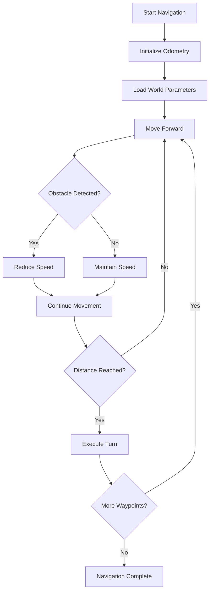

# TEAM 1: PARC Engineers League

## Introduction

The PARC 2025 Autonomy Track challenges teams to develop autonomous navigation solutions for agricultural robots operating in crop environments. Precision agriculture represents a transformative approach to farming that uses technology to optimize crop yields while minimizing resource waste through precise application of water, fertilizers, and pesticides. While adoption offers significant benefits including increased efficiency, reduced environmental impact, and improved crop monitoring capabilities, farmers face barriers such as high initial investment costs, technical complexity, and the need for specialized training. Our solution addresses the critical need for reliable autonomous navigation in structured agricultural environments, enabling robots to traverse crop rows efficiently while avoiding plant damage.

**Team Country:** Rwanda

**Team Member Names:**
* Cyusa Impano Chrispin (Team Leader)
* Tesi Eva Gasana
* Dufitimana Reponse
* Simugomwa Noella
* Divine Ishimwe Karamage
* Yves Godwin De Godson

## Dependencies

**Packages needed are:**

* `rclpy`: Python client library for ROS 2
   * `$ sudo apt-get install ros-jazzy-rclpy`
* `geometry_msgs`: ROS 2 geometry message definitions for Twist commands
   * `$ sudo apt-get install ros-jazzy-geometry-msgs`
* `nav_msgs`: Navigation message definitions for odometry data
   * `$ sudo apt-get install ros-jazzy-nav-msgs`
* `sensor_msgs`: Sensor message definitions for LaserScan data
   * `$ sudo apt-get install ros-jazzy-sensor-msgs`
* `numpy`: Numerical computing library for efficient array operations
   * `$ pip3 install numpy`

## Task

Our approach implements a speed-optimized navigation system using pre-calibrated distance and angle parameters for each world environment. The solution employs direct odometry-based positioning with LIDAR obstacle detection, utilizing increased movement speeds (2.5 m/s linear, 1.0 rad/s angular) and multi-threaded execution for enhanced performance. The robot follows precise waypoint navigation through crop rows using world-specific parameter sets that have been calibrated for optimal path traversal. Our system features adaptive speed control during obstacle detection, heading correction for straight-line movement, and efficient computational processing with reduced update cycles. The solution prioritizes completion time while maintaining plant avoidance through strategic front-arc obstacle detection and emergency stop capabilities.

**Command to run solution:**
```bash
ros2 run autonomy_solution task_solution.py
```

## Challenges Faced

* **Multi-world Parameter Calibration**: Determining precise distance and angle parameters for three different world environments required extensive testing and fine-tuning to ensure consistent navigation performance across varying row layouts and lengths.

* **Speed vs. Precision Trade-offs**: Balancing increased movement speeds for faster completion times while maintaining accurate positioning and obstacle avoidance capabilities, particularly during tight turns and narrow passages.

* **Odometry Drift Compensation**: Managing cumulative positioning errors during long navigation sequences by implementing heading correction algorithms and adaptive movement strategies to maintain straight-line paths.

* **Real-time Obstacle Processing**: Optimizing LIDAR data processing to reduce computational overhead while ensuring reliable front-arc obstacle detection, using numpy array operations and selective range filtering for efficiency.

* **Multi-threaded Execution Coordination**: Implementing parallel callback processing and thread-safe navigation execution to maximize system responsiveness and prevent blocking operations during movement commands.

* **Angle Normalization and Wraparound**: Handling angular calculations across the -π to π boundary, particularly during large rotation maneuvers, requiring robust angle difference calculations and target orientation management.

* **Dynamic Speed Adaptation**: Developing adaptive speed control systems that can seamlessly transition between high-speed navigation and cautious obstacle avoidance modes while maintaining smooth robot movement.

* **System Integration and Timing**: Coordinating multiple ROS 2 subscribers, publishers, and callback groups while maintaining precise timing control and ensuring proper initialization sequences for reliable operation.

## Technical Implementation Details

### Navigation Strategy
Our solution employs a waypoint-based navigation approach with pre-calculated paths for each world environment. The system uses direct distance and angle measurements rather than complex path planning algorithms, enabling faster execution and reduced computational overhead.

### Speed Optimization Features
- Increased linear speed to 2.5 m/s (3x faster than baseline)
- Enhanced angular speed to 1.0 rad/s for quicker turns
- Multi-threaded execution with ReentrantCallbackGroup
- Reduced update rate to 20Hz for faster control loops
- Streamlined obstacle detection focusing on narrow front arc

### World-Specific Parameters
The solution includes calibrated parameter sets for all three competition worlds:
- **World 1**: 8 forward distances, 7 turn angles
- **World 2**: 5 forward distances, 4 turn angles  
- **World 3**: 5 forward distances, 4 turn angles (variant of World 2)

### Safety and Reliability
- Emergency stop capabilities with immediate velocity zeroing
- Adaptive speed reduction when obstacles detected
- Heading correction during straight-line movement
- Robust angle normalization for wraparound handling
- Timeout protection for initialization sequences

## Performance Characteristics

| Metric | Value |
|--------|--------|
| **Target Completion Time** | Under 6 minutes per world |
| **Positioning Accuracy** | ±2% distance tolerance |
| **Angular Precision** | ±1.5 degree tolerance |
| **Obstacle Detection Range** | 0.25m safety threshold |
| **Update Frequency** | 20Hz control loop |

## Algorithm Flow



---

> **🏆 PARC 2025 Engineers League - Autonomy Track**  
> **🇷🇼 Team Rwanda - Optimized AgRobot Navigation Solution**  
> **⚡ Speed-Optimized • 🎯 Precision-Calibrated • 🛡️ Safety-First**
